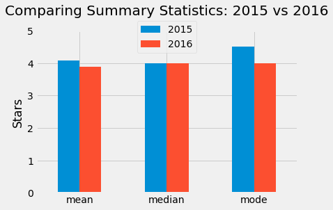

# Fandango Movie Ratings Analysis

In October 2015, a data journalist named Walt Hickey analyzed movie ratings data and found strong evidence to suggest that Fandango's rating system was biased and dishonest. He published his findings in [this article](https://fivethirtyeight.com/features/fandango-movies-ratings/).

In this project, I used sample statistics and kernel density plots to show that Fandango popular movie ratings have decreased on average by approximately 5% in 2016, a year after Hickey's report.

